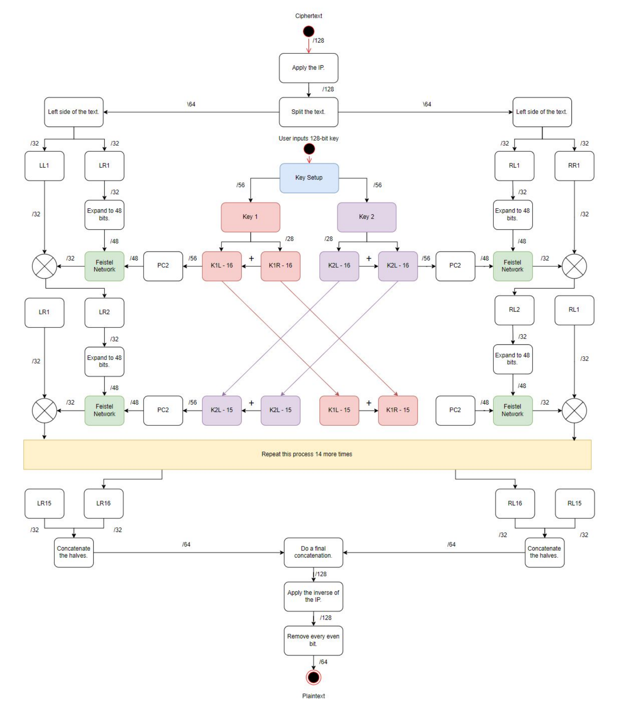

# SDES2 - Custom 2DES Implementation in Go  

SDES2 is a custom implementation of the 2DES cryptographic algorithm in Go, introducing enhancements such as salting, key-switching, bit shift randomization, and a mirrored Feistel structure. This project was developed to deepen the understanding of designing, testing, and assessing the security of cryptographic algorithms.

## Features  
- **Salting**: Adds randomness to prevent dictionary attacks.  
- **Key-Switching**: Alternates encryption keys for additional security.  
- **Bit Shift Randomization**: Introduces unpredictability to key rounds.  
- **Mirrored Feistel Structure**: Enhances encryption complexity.  
- **Parallel Processing**: Implements Goroutines for performance optimization.  

---

## Installation  

### Prerequisites  
Ensure you have Go installed on your system. You can download it from [Go's official website](https://go.dev/dl/).  

### Clone the Repository  
```sh
git clone https://github.com/YourUsername/SDES2.git
cd SDES2
```

### Build the Project  
```sh
go build -o sdes2
```

---

## Usage  

### Encrypt a Message  
```sh
./sdes2 -e -k "1234567890abcdef" -t "plaintext"
```
**Output**: Encrypted 32-character HEX string.  

### Decrypt a Message  
```sh
./sdes2 -d -k "1234567890abcdef" -t "ENCRYPTED_HEX_STRING"
```
**Output**: Decrypted plaintext message.  

### Enable Debug Logging  
```sh
./sdes2 -e -k "1234567890abcdef" -t "plaintext" -l
```

---

## Internal Design  
Here is the structure of our encryption and decryption process:  

 

The encryption follows a **mirrored Feistel structure**, with two parallel encryption paths, each using a separate round key schedule. The design ensures **increased diffusion and confusion**, making cryptanalysis significantly harder.

---

## Future Improvements  
- Implementing different key sizes for added flexibility.  
- Enhancing key schedule randomness.  
- Testing against known cryptographic attacks.  
